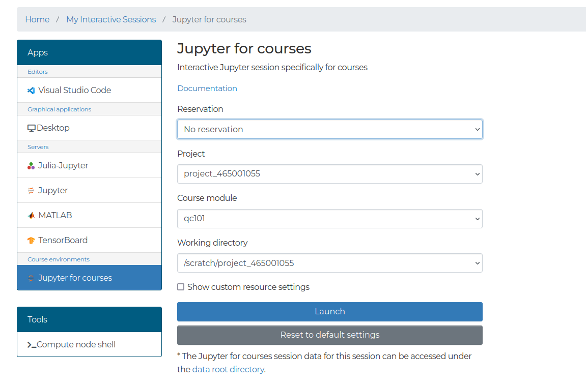

# Setup

Participants can follow along with the course notebooks either on their laptop or via the [LUMI Web interface](https://lumi.csc.fi).

## Locally with your laptop

This workshop can be followed along locally on your laptop.

If you already have a preferred way to manage Python versions and libraries, you can stick to that. If not, we recommend that you install Python3 and all libraries using [`miniconda`](https://docs.conda.io/en/latest/miniconda.html) a free minimal installer for the package, dependency and environment manager for [`conda`](https://docs.conda.io/en/latest/index.html>).


Please follow the installation instructions on [https://docs.conda.io/en/latest/miniconda.html](https://docs.conda.io/en/latest/miniconda.html) to install Miniconda3.

Make sure that both Python and conda are correctly installed:

```console
$ python --version
$ # should give something like Python 3.10.13
$ conda --version
$ # should give something like conda 23.7.2
```

A `requirements.txt` file is provided which contains all of the python packages to install a local software environment on your computer. Using this a `conda` environment can be created using the command:

```console
$ conda create --name qc101 -y python=3.12 pip
```

Which creates a new conda environment with Python 3.10 and `pip`. You can then activate it and install the python packages:

```console
$ conda activate qc101
$ pip install -r requirements.txt
```

You can download the `requirements.txt` [here](requirements.txt).

```{exercise} Download notebooks

[Download notebooks here](https://a3s.fi/NeIC-AH2024-Quantum/notebooks.zip)
```

## [LUMI Web interface](https://www.lumi.csc.fi)

1. Vist [lumi.csc.fi](https://www.lumi.csc.fi) and login using your select identity provider. For this workshop it will most likely be **MyAccessID**.
2. Select "Jupyter for Courses"
3. Use `project_465001055` and select the reservation `nordiquest`. For the working directory use `/scratch/project_465001055`.

To begin with visit [lumi.csc.fi](https://www.lumi.csc.fi) and login using your select identity provider. For this workshop it will most likely be **MyAccessID**.


